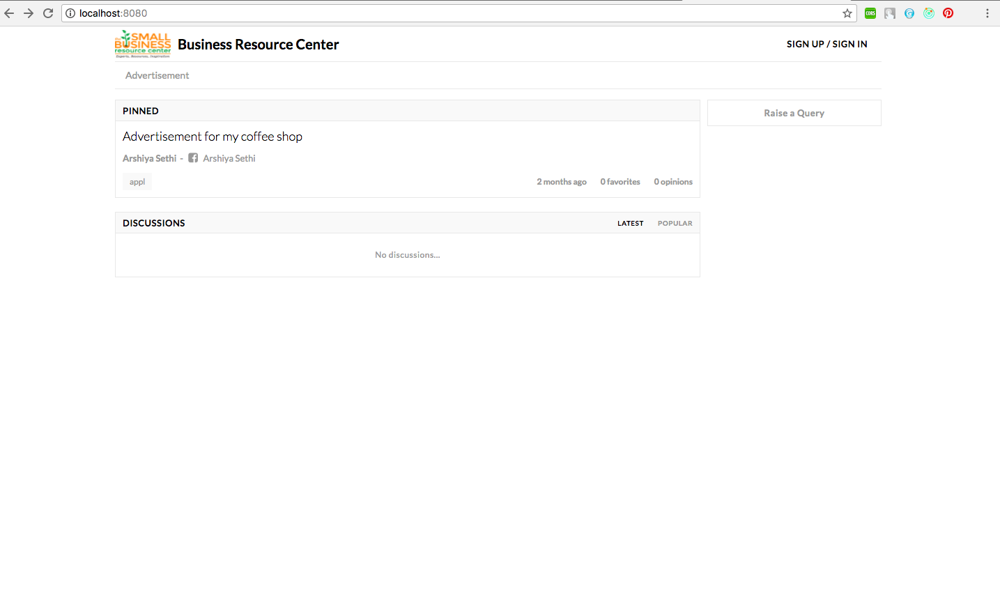
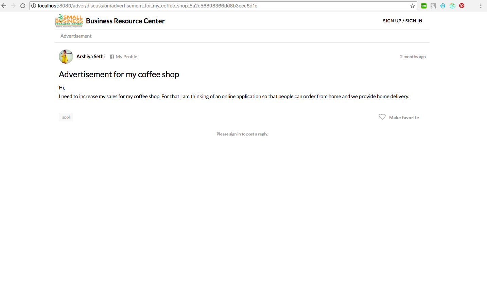

# Business Resource Center

Business Resource center is a one stop consultation service using vast resources in business, engineering, medicine and counseling with local businesses to help them solve real world problems. It is a service for local business of any size or type which provides the resources for creating a successful business. Even if the business is just starting or need to expand, Business resource center can service these businesses with the required resources.

Technologies used:

• Frontend: ReactJs, Redux  
• Backend:  node.js  
• Database: MongoDB 

Features:

• Login  
• Register 
• Create Services (for Admin only) 
• Post Problems 
• Post resolutions to the queries 
• Make solutions favourite 
• Delete the solutions 

Steps to run the application:

1. cd Business_Resource_Center 
2. npm install 
3. npm run start:dev 
4. Hit localhost:8080 in the browser. 
5. Access admin page using localhost:8080/admin after login

To run it on cloud
1. Hit http://54.153.10.226:8080/

Below are some screenshots demonstrating the application:

### Welcome Page

### Performing Operations

